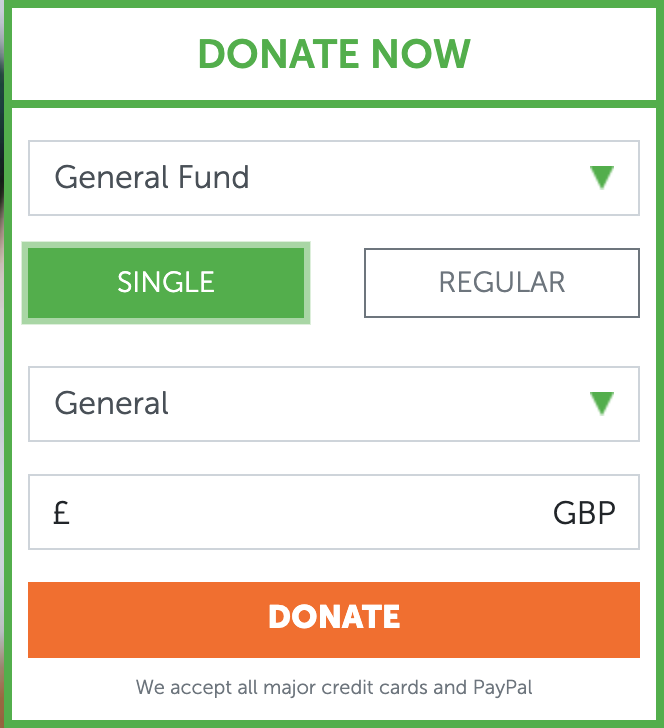

# donation-form

A N3O Package for use in client websites.

Provides the Donation Form component.

Variations are available: "Full" (square design where full choice of fund dimensions and price handles are presented) or "Quick" (horizontal design where only items for which the fund dimensions can be inferred are presented).

Both variations are rendered in the example code. Run `npm run serve` to run the example code.
  
E.g. Full Variation



E.g. Quick Variation


Data is fetched from GET `/umbraco/api/Donations/forms/{id}`. The ID can be found in your Umbraco project under Content -> Giving -> Donate Page. The ID for this form is visible by clicking on "Donate Page" and on the top right hand corner of the screen, selecting "Info". The ID number you want is the long GUID.

### Usage

As with all n3o frontend packages, install the package in the JS directory of the given client project.

```shell script
npm install @n3o/donation-form
```

Display of errors is left up to the user of this package. You may also want to install the Error Modal package, so that errors can be displayed in a consistent UI.

```shell script
npm install @n3o/error-modal
```

### Basic Use

```html
<script type="module">
    const el = document.querySelector("#donationForm");
    el.data = {
        formId: "a8492d39-1455-4de4-bcb2-e4d014d9bfc5",
        baseUrl: "https://localhost:5001",
        showFrequencyFirst: true,
        showCurrencyText: true,
        footerText: "We accept all major credit cards and PayPal",
        icons: {
          donateButton: {icon: "favorite", version: "filled" }
        }
      };
  </script>

<data-donation-form id="donationForm" type="full"> </data-donation-form>
```

### Use with error handling

`@n3o/error-modal` is installed as a dev dependency in this project, for demo purposes, and the code is pulled in to the `index.html` file.
 
See demo code in `index.html` for an example of how errors may then be displayed using the N3O Error Modal component.

### Styling

Lit creates a Shadow DOM for each web component that is rendered within the document.

As such, developers do not have full control over shadow DOM styling from the outside.

Styles can be configured by setting CSS variables. Full list of CSS variables which may be configured for this component are listed in the demo code in `index.html`.

Additional variables can easily be added, please contact the project authors or open a PR.

### Fonts & Icons

This component currently supports **Material Icons**.

In order to include these icons, add or load the Material Icon font in your root HTML document, e.g.:

```html
<style>
    @font-face {
      font-family: 'Material Icons';
      font-style: normal;
      font-weight: 400;
      src: url(https://fonts.gstatic.com/s/materialicons/v121/flUhRq6tzZclQEJ-Vdg-IuiaDsNcIhQ8tQ.woff2) format('woff2');
    }
</style>
```

Define as variables the icons you wish to use in various places in this component, passing the name of the icon you wish to display from the [Material Icons Library](https://fonts.google.com/icons):

```javascript
el.data = {
      ...,
      icons: {
        donateButton: {icon: "favorite", variety: "filled" }
      }
    };
```

The variety may be "filled", "outlined", "rounded" or "sharp" (defaults to "filled").

Check the full list of configurable CSS variables in `index.html` for further customization options, such as `--donate-button-icon-color`